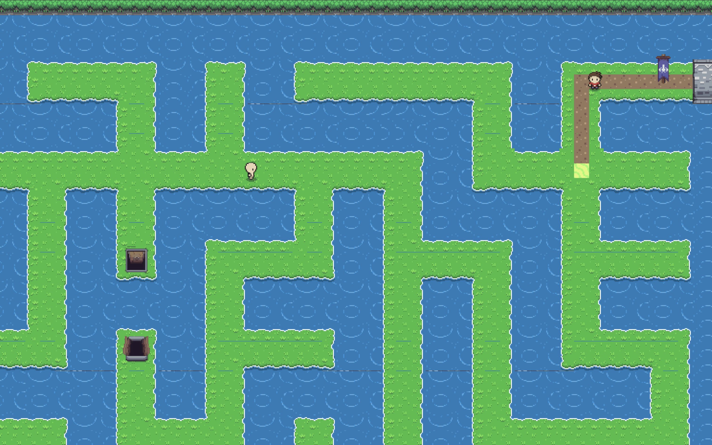
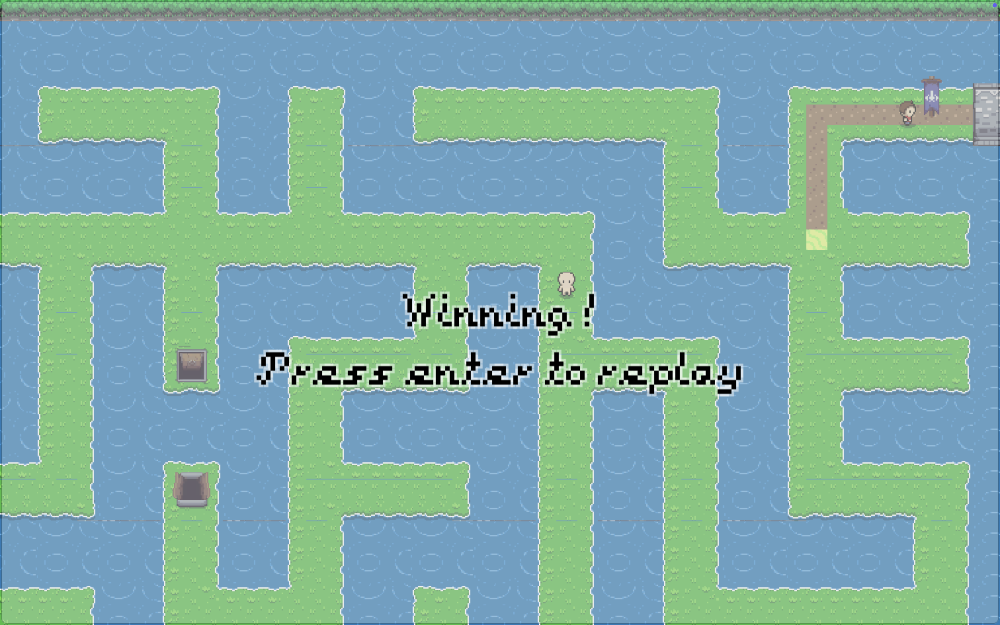

# Pucca Runner

puccarunner.github.io: Pathfinding with a 2D hash map and Dijkstra’s algorithm; runner moves toward the player and triggers collision on boundary breach

## Path To Win

## Final Goal

## Win

